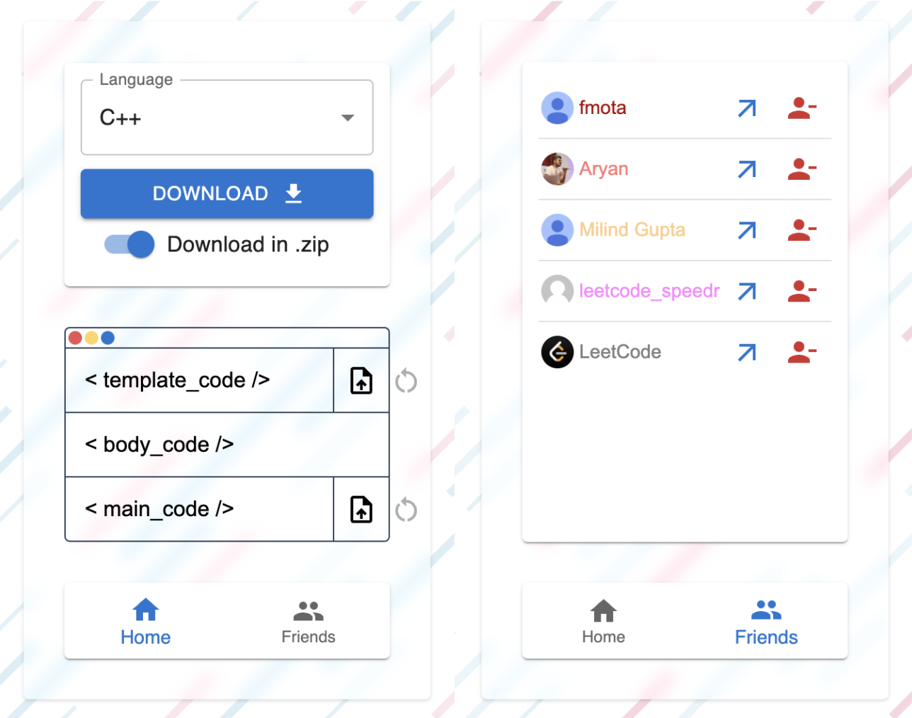
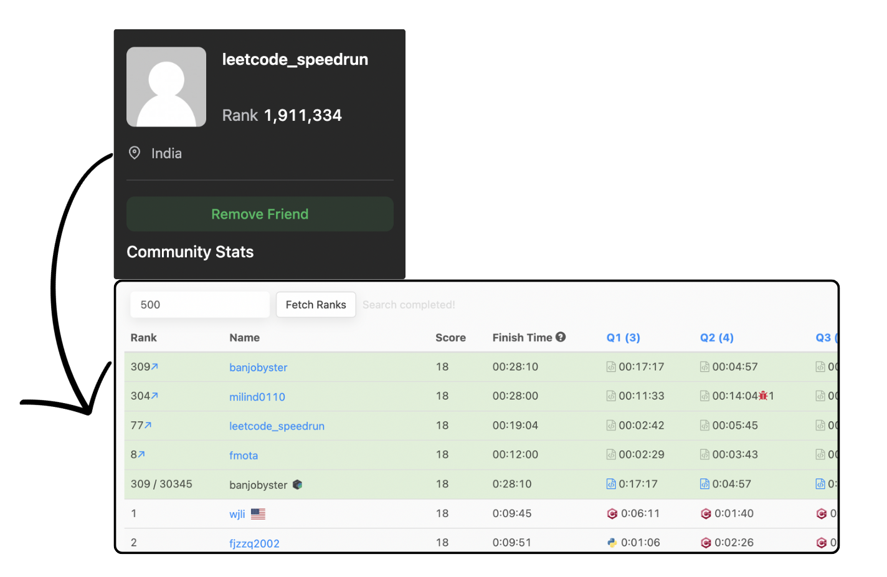
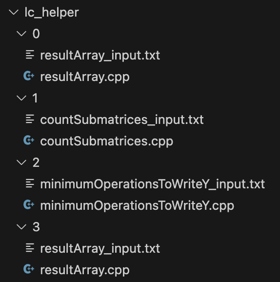
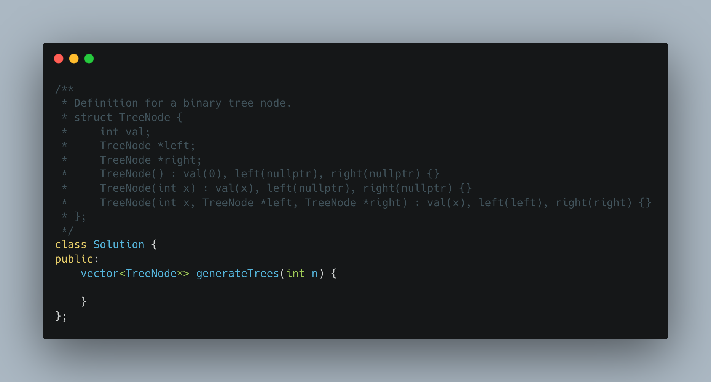
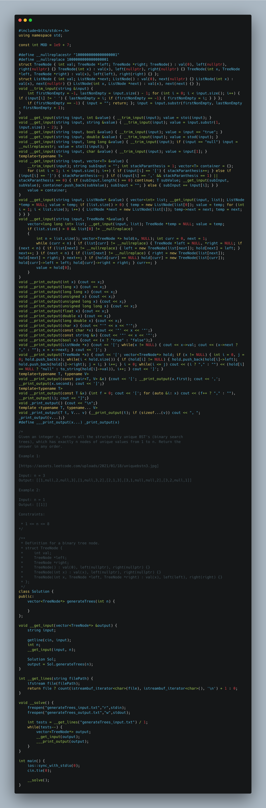

# Leetcode Contest Helper Extension

## Overview
The Leetcode Contest Helper Extension is a tool designed to streamline the coding experience during LeetCode contests. It eliminates the manual effort of writing additional code for input/output handling, allowing you to focus on solving problems efficiently inside your favorite code editor.

## Features
- **Automatic Code Download:** Quickly download code during contests or for individual problems.
- **Code Templates:** Support for custom code templates and main functions.
- **Language Support:** Extensive support for C++, with the option to choose other languages.
- **Friend Rankings:** Add friends and view their live rankings in contests.

## How to Use
1. Install the extension from the Web Store.
2. Navigate to the LeetCode contest or individual problem page.
3. Open the extension and click the "Download" button to fetch the code.
4. Customize code templates and main functions as needed.

## Note
- Support for questions of type QUERY is not available.
- Currently, extensive support is provided for C++, with options for other languages.

## Images
### Extension Pages

### Fetch Rankings

### Downloaded Folder

### Code in LC Editor

### Generated code which can be build and run

This generated code takes input from `{fileName_input}.txt` and outputs to `{fileName_output}.txt`. 


<br /><br />

# For Developers

### Extending Language Support

To incorporate support for additional programming languages, follow these steps within the `src/codes/{language}/mapping.js` file:

1. **Update Mapping Functions:**
   - Locate and modify the `get_template()`, `get_body()`, and `get_main()` functions in the `mapping.js` file for the respective language.

2. **Function Parameters:**
   - Each function receives three props: 
     - `content`: Contains the question and examples.
     - `codeSnippet`: The code present in the LeetCode code editor.
     - `metaData`: Contains input and output data types.

3. **Code Structure:**
   - `Template`: consists of utility functions aiding problem-solving.
   - `Body`: Comprises the content in comments followed by the code snippet. Include helper functions that read any type of input and print any type of output in format provided by LeetCode.
   - `Main`: Should iterate over test cases, utilize helper functions, or define them within the main function. Ensure it interacts with the Solution class and displays output as done by LeetCode.

4. **Reference Existing Implementation:**
   - Refer to the existing `mapping.js` files in the `src/codes/cpp/mapping.js`, for better understanding.

5. **Data Types:**
   - The extension currently recognizes the following data types: `string`, `integer`, `boolean`, `double`, `long`, `char`, `ListNode`, `TreeNode`, `void`, and `float.` 
   - For arrays, they are represented as either using `{dataType}[]` notation, or using `list<>` syntax. 
      - For example, a 2D array of strings can be denoted as `string[][]` or `list<list<string>>`.

## Folder Structure
```
public
├── content-script.js
├── images
│   └── icon.png
└── manifest.json
src
├── App.css
├── App.jsx
├── codes
│   ├── erlang
│   ├── kotlin
│   ├── python
│   ├── rust
│   ├── bash
│   ├── python3
│   ├── scala
│   ├── c
│   ├── mssql
│   ├── pythondata
│   ├── swift
│   ├── cpp
│   ├── golang
│   ├── mysql
│   ├── pythonml
│   ├── typescript
│   ├── csharp
│   ├── html
│   ├── oraclesql
│   ├── racket
│   ├── react
│   ├── ruby
│   ├── exampleProblem.json
│   ├── exportMappings.js
│   └── languages.json
├── components
│   ├── codeComponent.jsx
│   ├── downloader.jsx
│   ├── languageSelector.jsx
│   └── utils
│       ├── backgroundDesign.css
│       ├── backgroundDesign.jsx
│       ├── getDataGraphql.jsx
│       ├── getDataRest.jsx
│       └── startDownload.jsx
├── pages
│   ├── friends.jsx
│   └── home.jsx
└── store
    ├──Store.jsx
    └── stateStore.jsx
```
1. **`public` Directory**
   - **`content-script.js`:** Contains functions for injecting scripts and DOM elements into leetcode to fetch friends' rankings and add friends.
   - **`images`:** Directory housing the project logo (`icon.png`).
   - **`manifest.json`:** Configuration file for the extension.

2. **`src` Directory**
   - **`App.css` and `App.jsx`:** Responsible for styling and serving as the main component for the extension iframe.
  
   2.1. **`src/codes` Directory**
      - Subdirectories for each supported programming language, each containing `mapping.js` and a test file.
      - **`exampleProblem.json`:** Holds example problem data.
      - **`exportMappings.js`:** File for exporting language mappings.
      - **`languages.json`:** Configuration file listing information about supported languages.

   2.2. **`src/components` Directory**
      - **`codeComponent.jsx`, `downloader.jsx`, `languageSelector.jsx`:** React components handling various functionalities.
  
   2.3. **`components/utils` Directory**
      - Utility components for the extension.
      - **`backgroundDesign.css` and `backgroundDesign.jsx`:** Manage styling and functionality for the extension background.
      - **`getDataGraphql.jsx` and `getDataRest.jsx`:** Functions for fetching data using GraphQL and REST, respectively.
      - **`startDownload.jsx`:** Handles the functionality to initiate code download.

3. **`src/pages` Directory**
   - **`friends.jsx` and `home.jsx`:** React components for the 'Friends' and 'Home' pages.

4. **`src/store` Directory**
   - **Store.jsx` and `stateStore.jsx`:** Components managing extension state and a Zustand global state.


Feel free to contribute and enhance language support or add new features.

Happy Coding! 🚀
